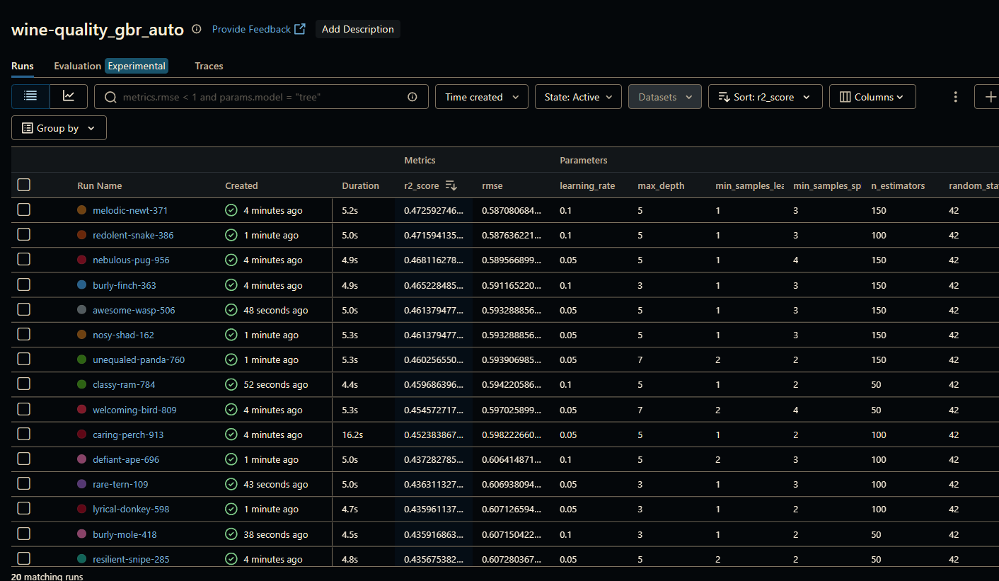
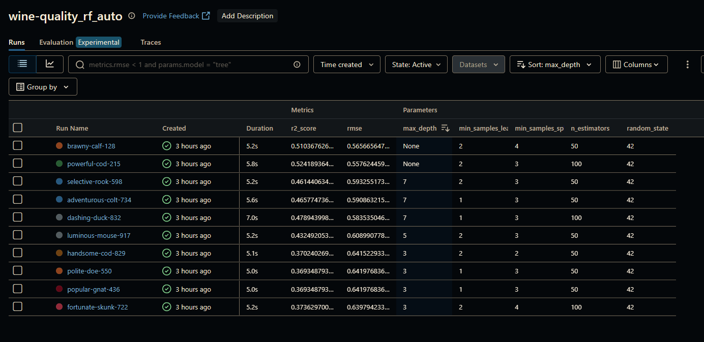

### Описание Экспериментов с моделями `GradientBoostingRegressor` и `RandomForestRegressor`

## Цель

Предсказать **качество красного вина** по его физико-химическим характеристикам. Мы исследуем две ансамблевые модели: `RandomForestRegressor` и `GradientBoostingRegressor`. Все эксперименты проводились с трекингом через **MLflow**, данные — через **DVC**.

---

## Почему выбраны именно эти модели?

### Random Forest Regressor (Случайный лес)
- Работает "из коробки"
- Устойчив к переобучению
- Низкие требования к предобработке
- Хорошо справляется с табличными и шумными данными

### Gradient Boosting Regressor (Градиентный бустинг)
- Более высокая предсказательная мощность при правильной настройке
- Лучше улавливает сложные зависимости
- Используется как стандарт де-факто во многих ML-задачах 

---

## Методология

- **Датасет**: [`winequality-red.csv`](./data/winequality-red.csv)
- **Целевая переменная**: `quality`
- **Метрики оценки**:
  - `RMSE` — среднеквадратичная ошибка
  - `R²` — коэффициент детерминации
- **Разделение**: `train_test_split` (80% / 20%)
- **MLflow Tracking**:
  - Запуски логируются в `../mlruns`
  - Используются автоматические циклы с рандомизацией гиперпараметров
- **Версионирование моделей**:
  - Все сохранения идут через `joblib.dump()` 
  - Папка `model/` в DVC

---

## Результаты

| Модель                    | Лучшая RMSE | Лучшая R² |
|---------------------------|-------------|-----------|
| RandomForestRegressor     | **0.5576**  | **0.5241**|
| GradientBoostingRegressor| 0.5870     | 0.4725    |

---

## Выбор лучшей модели

**Выбрана модель: `RandomForestRegressor`**

**Плюсы:**
- Выдала лучшие метрики на тесте (`RMSE ↓`, `R² ↑`)
- Менее чувствительна к выбору гиперпараметров
- Быстрее обучается
- Надежна при шумных данных

**Минусы `GradientBoostingRegressor`:**
- В данной задаче не смог превзойти RF
- Требует тонкой настройки и оптимизации параметров
- Более подвержен переобучению на малых данных

---

## Можно ли добиться R² ≈ 1?

Нет, по следующим причинам:
- Оценка вина имеет **субъективную природу**
- Признаки (кислотность, сахар и т.д.) **не полностью объясняют качество**
- Наблюдается **шум**, **дисбаланс классов** и **ограниченный размер датасета**

---

## Артефакты экспериментов

-  `data/` — датасет под управлением DVC
-  `./experiments/model/` — сохраняется лучшая модель (`best_rf.pkl`), добавлена в DVC
-  `mlruns/` — НЕ включён в Git
-  `rf_experiment.py`, `gbr_experiment.py` — скрипты запуска экспериментов

---

## Скриншоты из MLflow
GBR

RF

---
